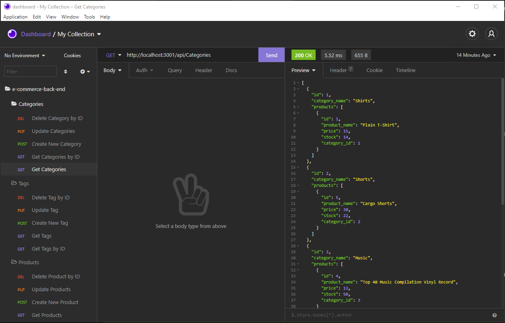
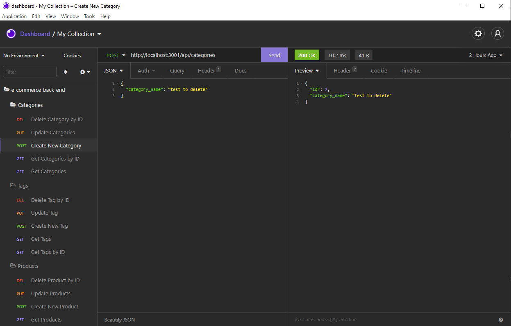

# E-Commerce Back End (Object-Relational Mapping)

This back end app is built for managing e-commerce website using Node.js, Express.js as back end API server and MySQL as back end dababase. It allows an internet retail company manager be able to:

* get the schema created according to spec when server starts;

* seed the database from the command line;

* start the application server;

* test GET routes for all categories, all products, and all tags;

* test GET routes for a single category, a singe product, and a single tag by id;

* test POST, PUT, and DELETE routes for categories, products, and tags.

App deployed address: https://sherryecommercebackend.herokuapp.com/

Some screen shots of the app tested in Insomnia Core:

For any questions please reach out to sherryzheng2018@gmail.com

Enjoy the app!